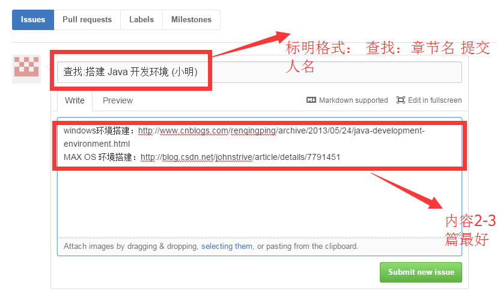
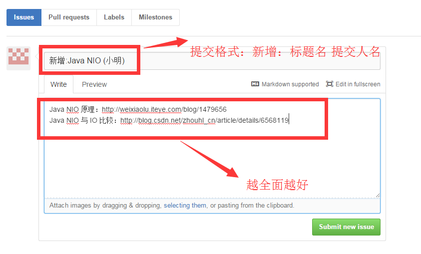
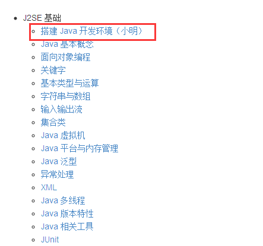

# Java 专题极客版

Java 专题采用在线协作模式进行内容填充的，主要内容涉及 J2SE 基础、Java Web 开发、Java 常用框架、Java 软件工程与设计模式、Java 操作系统、数据库和网络、Java 新技术、Java 数据结构和算法等几个大的分类。

## 参与好处

- 协作模式体验，加强大家之间的互动，让每个人都有参与感。
- 文章发布不仅署名来源，**更会署名查找者姓名**，原则是：谁找到署谁名，先到先得。
- 你们的贡献，最终会汇聚成一本制作精美的电子书，方便给他人展示。
- **会选取共享最多的2人，装订纸质书籍赠送。**

## 内容标准

- 国内外最新 IT 技术类文章
- 选题内容要求偏重能够解决实际问题
- 最好有配图，图文说明清晰

## 如何参与

### 题目已经有

通过提 issues，来认领你想要填充的内容。

**例如：**

小明领取**搭建 Java 开发环境**章节，然后通过互联网搜索相关素材，将连接地址提交 issues。如下图提交 issues。

### 题目没有，想要新增

通过 issues，提出你认为有价值的关于本专题的知识点。

**例如：**

小明找到一篇关于**Java NIO**的内容，如下图提交 issues。

## 进入目录选题

[目录 TOC.md](TOC.md)

## 审核时间

工作日周一到周五会有管理员不定期审核，审核通过后就会将目录更新。

## FAQ

Q：我可以找别人已经找到的课题吗？都会署名吗？

A：可以，只要通过，就会署名。但是建议选择没有人选中的课题。

Q：要是同一篇文章被多人找到怎么办？

A：**2 人**，一篇文章最多署名 2 人，所以请大家积极提交，我们会及时处理。

Q：我想要关于某一课题自己写，应该如何参与？

A：Fork 下这个项目，然后把对应的内容填上，提交给我们，我们会标明原创和作者。

## 联系方式

QQ ：345777566 402480671 1685160814

Email：wiki@jikexueyuan.com

